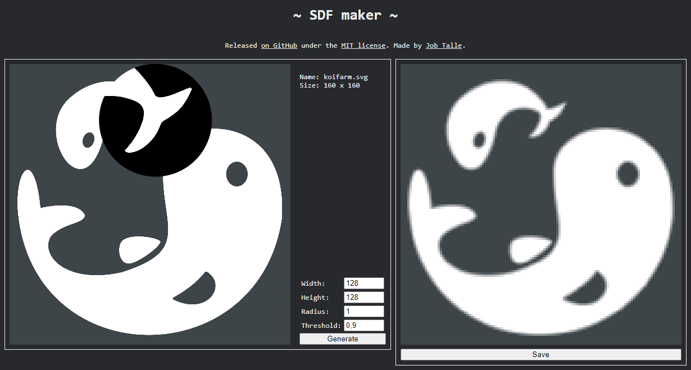

# SDF Maker
A tool for converting high resolution images or textures with transparency to low resolution images with signed distance fields.
[Runs in a browser!](https://jobtalle.com/SDFMaker)



## How to use it?

1. Drag an image file to the drop target on the left. This can be a .PNG image with transparency or a .SVG vector image.
2. Choose the output resolution. For good results, the output resolution should be several times smaller than the input resolution. If the input image is a .SVG image, the tool converts it to a 4k input image to ensure the input resolution is high enough.
3. Click the "generate" button to produce the output image. The output image is a .PNG image that can be downloaded.

The quality of the output SDF can be previewed by hovering the cursor over the left panel that contains the input image. A circular area around the mouse shows how the SDF sprite will be rendered. If the left mouse button is pressed, the preview is zoomed by 200%.

## Settings

|Setting|Description|
|---|---|
|Radius|The radius of the signed distance field. This can be 1 in most cases, but it can be increased if the SDF will be used for things like outline rendering.|
|Threshold|The input image opacity threshold that is considered opaque. Any input pixel with alpha over this threshold is considered opaque.|

## PNG output

The tool uses [UPNG.js](https://github.com/photopea/UPNG.js/) to produce output .PNG images, since not all browsers can produce .PNG images with colorized transparent pixels natively. In many cases, transparent pixels will become black, losing their color. This causes problems with mipmapping, since the black color blends into the neighboring pixels when downscaling to lower mipmap levels. This tool sets the color of transparent pixels to the color of the nearest opaque pixel and uses UPNG.js generate the output image, preventing the issue.

## Rendering SDF edges in GLSL

To render SDF textures, the alpha channel of a pixel should not be interpreted as the transparency of that pixel, but rather as the distance to the edge of the image, where `0.5` is exactly on the edge. The following GLSL snippet outputs transparent pixels whenever they are outside the shape:

``` glsl
vec4 pixel = texture(source, uv);
vec4 color = vec4(pixel.rgb, step(0.5, pixel.a);
```

This example sets alpha to either `0` or `1`. Edges can also be anti aliased using the following GLSL snippet:

``` glsl
const float epsilon = 0.000001;

vec4 pixel = texture(source, uv);
float alpha = clamp((pixel.a - 0.5) / max(fwidth(pixel.a) * 0.5, epsilon), 0.0, 1.0);
vec4 color = vec4(pixel.rgb, alpha);
```

This example interpolates alpha from `0` to `1`, creating smooth anti aliased edges.